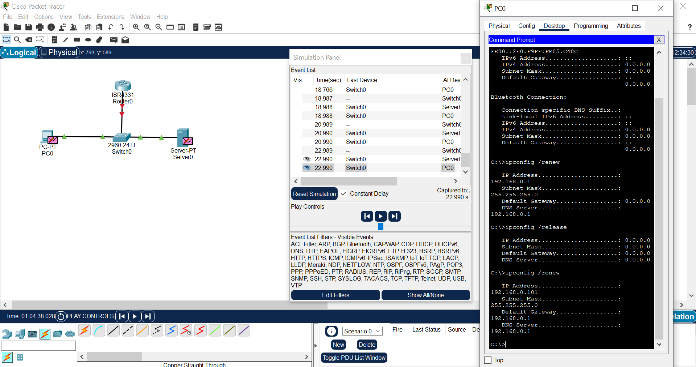

# state of the Network for proff of work

While exploring packet tracer, i simulated a network that :

- share a communication between a pc, a switch, a server and router.

- we simulated this to have an idea of how it work in a real world

- we face some chalenges while configuring the dhcp cause we notice it doesn't allow us to create new service with feature without deleting the previous task.

- We where able to settle a communication from these devices.

- We are happy because we face the challenge and we succeed.

