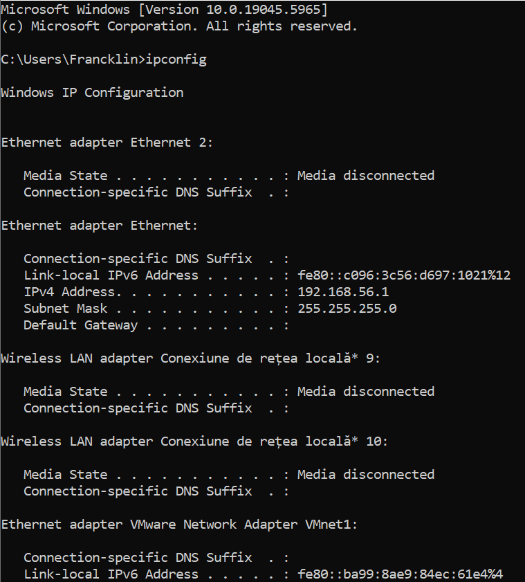
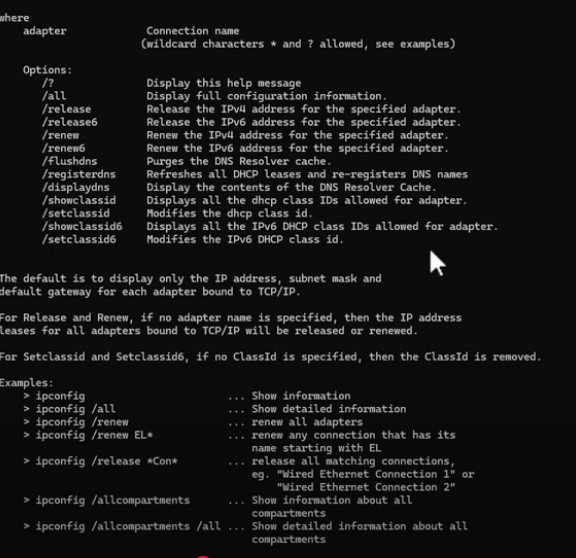
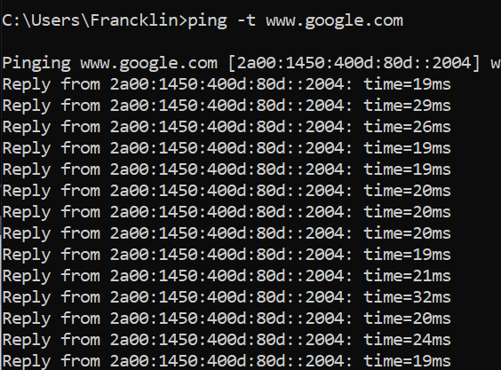
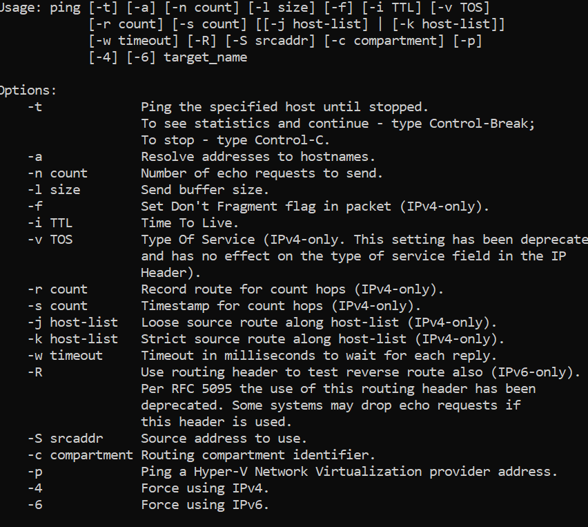

# Windows Networking tools

We start by openning `command prompt` on our windows search bar and start typing these command in order to have more answer:

- ipconfig:

provide list of information about the pc and ip address

- ipconfig /?

Display this help manager

- ipconfig /all 

Display full configuration information

- PING for testing connectivity and mesurement

- ping /?:

- Tracert for tracking your connectivity and see where packet drop

- NSlookup to solve dns problem.

- Netstat will shwow active connection that my computer have.

- netstat -r

- pipa when you it it mean dhcp doesn't work and you have to debugg my dhcp.