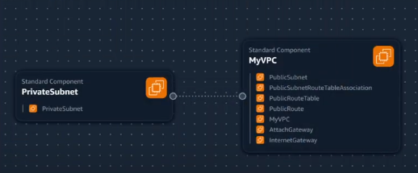

## Journaling

## VPC SETTING

These are the VPC settings we observes Tim setup for our cloud environment in AWS:

- VPC IPv4 CIDR Block: 10.200.124.0/24
- IPv6 CIDR Block: No
- Number of AZs: 1
- Number of private subnets: 1
- Number of public subnets: 1
- NAT GATEWAYS: NONE
- VPC Endpoints: None
- DNS Options: Enable DNS Hostnames
- DNS options: Enable DNS Resolution

## Generate and Review CFN Template

Watching the instructors videos, I noted the vpc setting, provided this to LLM to produce the CFN template to automate the provision of the vpc infrasture.

- I had to ask to the LLM to refactored the paramaters so that it would not hardcode values and the template is more reusable

## Generate Deploy Script

Using chatgpt generated a `bin/deploy`

i changed the shibang to work in all platform

## How to deploy

### check your AWS Account
```sh
aws sts get-caaler-identity`
```

```sh
cd project/env_automation
chmod u+x ./bin/deploy
./bin/deploy
```

## Visualization in Infrastrure composer

I tought we could visualize our vpc via infrastructure composer but it's not the best representations



